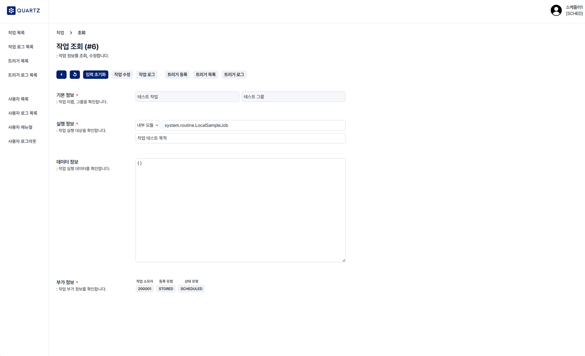
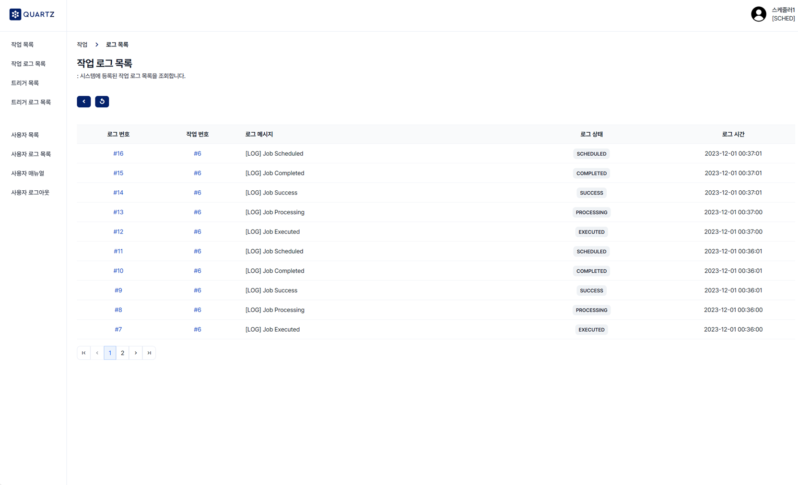
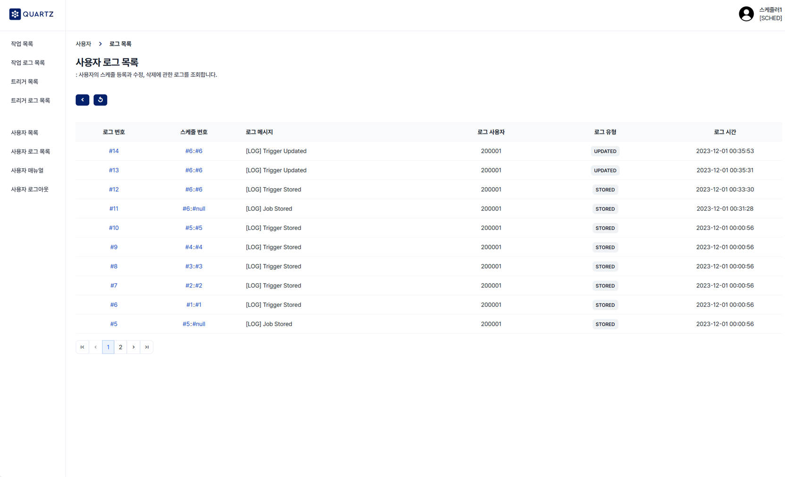

<div align="center">
  <h1>스케줄러 웹 시스템</h1>
</div>

<div align="center">
  
  
  
  
  
  
  <br>
  
  
  
  
  
</div>
<br>

<div align="left">
  <h2>1. 개발 환경</h2>

- <p><b>OS: </b>Windows (11, 64 Bit)</p>
- <p><b>DB: </b>Maria DB</p>
- <p><b>IDE: </b>IntelliJ</p>
|       라이브러리        | 사용 목적                                                                    |
|:------------------:|--------------------------------------------------------------------------|
|   `quartz@2.3.2`   | 실행 조건을 동적으로 결정하고 상세 내역을 DB 데이터로 관리하기 위해 사용하였다. |
| `cron-utils@9.2.0` | Cron 표현식의 규칙을 정의하는 여러 방식 중, Quartz 라이브러리와 호환되는 유효성 검증 API를 사용하기 위해 사용하였다. |
</div>
<br>

<div align="left">
  <h2>2. 실행 화면</h2>









</div>
<br>

<div align="left">
  <h2>3. 프로젝트 구조</h2>

  ```
  *
  ├─ module-core
  │  ├─ system.api/**: 사용자 및 스케줄링 관련 컨트롤러 클래스
  │  ├─ system.core/**: 사용자 및 스케줄링 관련 도메인/서비스 클래스
  │  ├─ system.routine/**: 내부 모듈 작업 클래스
  │  ├─ system.share/**: 공통 설정 클래스
  │  └─ src/resources/**: 설정 파일 및 웹 페이지 파일(JSP, CSS, JS)
  │
  └─ module-remote
     └─ system.remote.routine/**: 외부 모듈 작업 클래스
  ```
</div>
<br>

<div align="left">
  <h2>4. 구현 기능</h2>

#### 1) 사용자
- 사용자 등록, 사용자 로그 조회, 로그인/로그아웃

  ```
  사용자 로그: 스케줄을 등록, 수정, 삭제할 때 관련 내역을 기록한다.
  ```
#### 2-1) 스케줄 (작업)
- 작업 조회 및 등록, 수정, 삭제
- 작업은 실행 대상이 되는 데이터로 내부/외부 모듈에 작성된 작업 클래스가 실행한다.

  ```
  내부 모듈(module-core.jar): 스케줄러 모듈 (스케줄링, 이벤트 로깅, 웹 페이지 라우팅 등을 포함한다.)
  외부 모듈(module-remote.jar): 작업 클래스 모듈 (내부 모듈 실행 시, 외부 모듈을 클래스패스에 등록하여 사용한다.)
  ```
#### 2-2) 스케줄 (작업 로그)
- 작업 로그 조회 및 등록
- 각 작업의 실행 과정 및 결과를 기록한다.
#### 2-3) 스케줄 (트리거)
- 트리거 조회 및 등록, 수정, 삭제
- 트리거는 작업을 실행하는 조건이 되는 데이터로 실행 유형(SP/CR)과 트리거 불발 정책을 선택하여 사용한다.

  ```
  SP(Simple): 실행 횟수, 실행 간격으로 기준으로 실행 조건을 만든다.
  CR(Cron): Cron 표현식을 기준으로 실행 조건을 만든다.
  ```
#### 2-4) 스케줄 (트리거 로그)
- 트리거 로그 조회 및 등록
- 작업과 관련된 각 트리거의 실행 과정 및 결과를 기록한다.
</div>
<br>

<div align="left">
  <h2>5. 문제 해결</h2>

#### 1) 스케줄 DB 데이터와 사용자 DB 데이터 연계
- 쿼츠 라이브러리는 스케줄을 등록한 사용자를 구분하지 않는다.
- 쿼츠 라이브러리에 작성된 SQL 및 로직을 변경하는 것은 적합하지 않다고 판단하였다.

  ```
  작업/트리거 데이터를 관리하는 별도의 DB 테이블을 만들고 사용자 DB 테이블과 연관 관계를 두었다.
  ```
#### 2) 스케줄 DB 데이터의 자동 삭제 문제
- 쿼츠 라이브러리는 실행이 종료된 작업과 트리거의 DB 데이터를 자동으로 삭제한다.
- JobBuilder.storeDurably(true) 메소드로 작업 데이터를 유지할 수 있으나 트리거와 관련된 API는 지원하지 않는다.

  ```
  작업/트리거 데이터를 관리하는 별도의 DB 테이블을 만들고 CRUD 작업 시, 쿼츠 DB 테이블과 동일한 데이터를 갖도록 로직을 작성하였다.
  ```
#### 3) 스케줄 로직의 중복 코드 문제
- 사용자가 입력한 스케줄 데이터를 등록, 수정, 검증하는 로직이 반복적으로 사용되었다.

  ```
  해당 로직을 재사용하는 JobUtils, TriggerUtils 클래스를 구현하였다.
  ```
  > [system.core.service.schedule.job.JobUtils.java](https://github.com/jha3on/22-Scheduler-System/blob/master/module-core/src/main/java/system/core/service/schedule/job/JobUtils.java) <br>
  > [system.core.service.schedule.trigger.TriggerUtils.java](https://github.com/jha3on/22-Scheduler-System/blob/master/module-core/src/main/java/system/core/service/schedule/trigger/TriggerUtils.java) <br>
#### 4) 일부 Cron 표현식을 파싱하지 못하는 문제
- Quartz 라이브러리의 Cron 표현식을 검증하는 API는 느슨하게 구현되어 있어서 일부 잘못된 식을 확인하지 못한다.
- cron-utils 라이브러리를 대체 용도로 사용하였으나 Cron 표현식을 정의하는 방식이 일부 다르기 때문에 문제가 발생하였다.<br>
  (cron-utils 라이브러리는 CRON4J, QUARTZ, UNIX, SPRING, SPRING53 5가지 방식으로 구분하고 있다.)

  ```
  TriggerValidator 클래스에서 QUARTZ 방식의 Cron 표현식을 검증하는 cron-utils 라이브러리를 사용하였다.
  ```
  > https://stackoverflow.com/questions/52252273 <br>
  > [system.core.service.schedule.trigger.TriggerValidator.java](https://github.com/jha3on/22-Scheduler-System/blob/master/module-core/src/main/java/system/core/service/schedule/trigger/TriggerValidator.java) <br>
  > https://mvnrepository.com/artifact/com.cronutils/cron-utils <br>
#### 5) 외부 모듈(.jar 파일)의 경로를 찾지 못하는 문제
- 스케줄러 시스템과 독립된 상태로 작업 클래스만 빌드할 수 있도록 외부 모듈로 분리해야 한다.
- 위의 내용과 클래스패스에 외부 .jar 파일을 등록하는 방법은 아래 문서를 참고하였다.

  > https://homoefficio.github.io/2019/09/28/Quartz-스케줄러-적용-아키텍처-개선-1 <br>
  > https://github.com/HomoEfficio/dev-tips/blob/master/IntelliJ%20외부%20jar%20파일을%20클래스패스에%20추가하는%20방법.md <br>
</div>
<br>